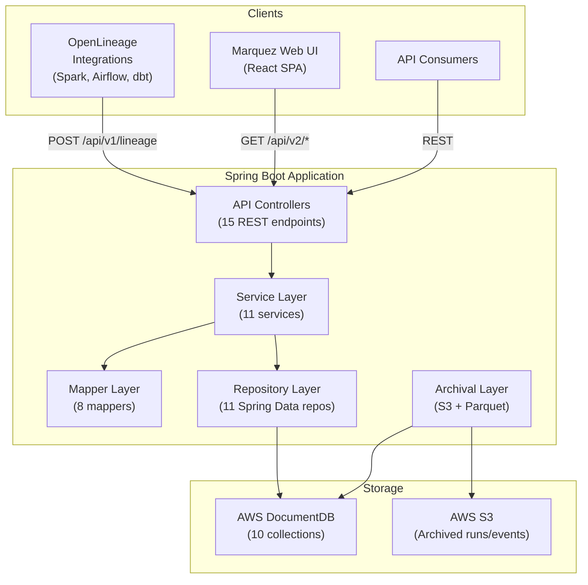
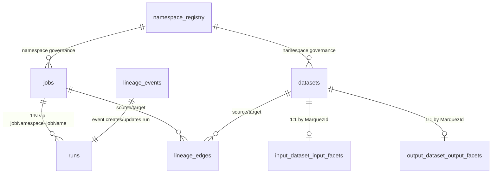
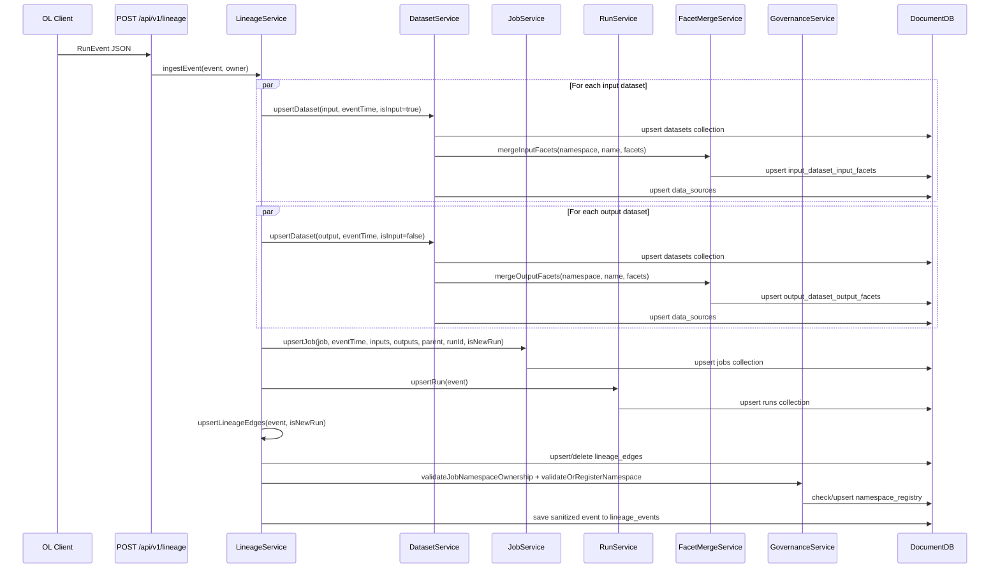
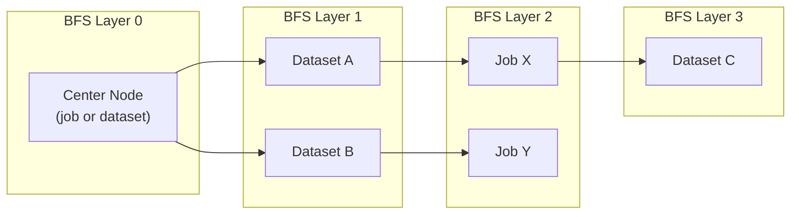
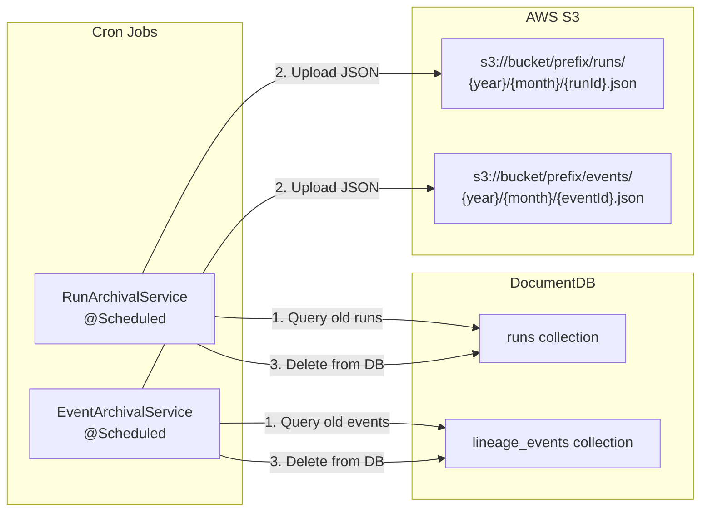
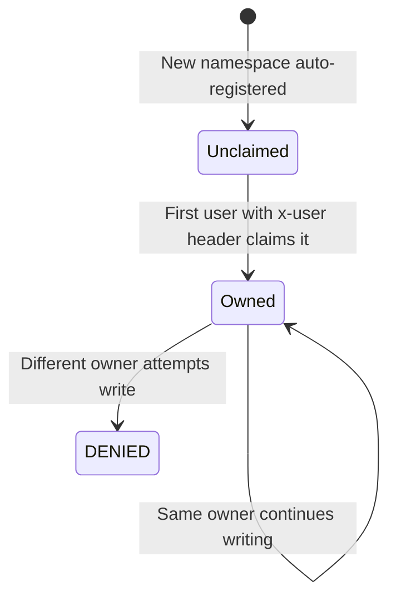
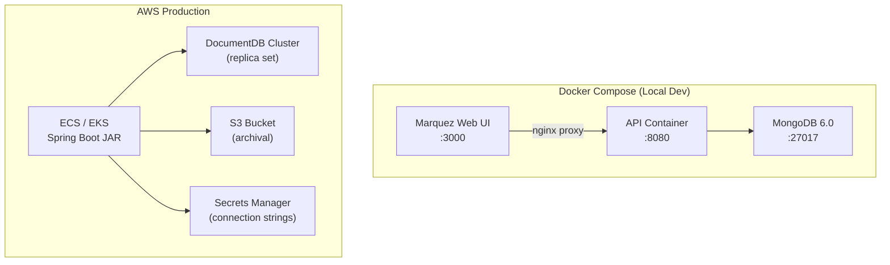

# Low-Level Design: OpenLineage MongoDB API

A DocumentDB-based reimplementation of the [Marquez](https://github.com/MarquezProject/marquez) lineage metadata API.

---

## 1. System Overview

### 1.1 Purpose

This system replaces the original Marquez API backend. Marquez uses **PostgreSQL** with complex relational schemas (20+ normalised tables, JOINs, recursive CTEs) and JDBI for data access. The new system uses **AWS DocumentDB** (MongoDB-compatible) with a denormalised document model optimised for write-heavy lineage event ingestion and graph traversal reads.

### 1.2 Technology Comparison

| Concern | Marquez (Original) | OpenLineage MongoDB (New) |
|---|---|---|
| **Database** | PostgreSQL | AWS DocumentDB (MongoDB 6.0 compat) |
| **Framework** | Dropwizard (JAX-RS) | Spring Boot 3.2 (Spring MVC) |
| **Data Access** | JDBI (raw SQL + DAOs) | Spring Data MongoDB + `MongoTemplate` |
| **Schema** | 20+ normalised tables with foreign keys | 10 denormalised document collections |
| **Lineage Graph** | Recursive SQL CTEs | Application-level BFS with batch queries |
| **Event Storage** | `lineage_events` table | `lineage_events` collection + TTL index |
| **Facets** | JOINed facet tables | Split into `input_dataset_input_facets` / `output_dataset_output_facets` collections |
| **Runs** | Full relational model with run states table | Single `runs` collection with upsert-based state machine |
| **Search** | PostgreSQL full-text search (`tsvector`) | Regex on `_id.name` (DocumentDB lacks `$text`) |
| **API Spec** | OpenAPI via Dropwizard | OpenAPI via springdoc-openapi 2.3 |
| **Observability** | Prometheus via Dropwizard metrics | Spring Boot Actuator + Micrometer Prometheus |
| **Archival** | None (relies on DB retention) | S3-based archival with Parquet support |

### 1.3 High-Level Architecture



---

## 2. Package Structure

```
com.openlineage.server
├── OpenLineageServerApplication.java     # Spring Boot entry point
├── api/                                  # REST controllers (15 files)
│   ├── models/                           # Request/Response DTOs (11 files)
│   ├── OpenLineageResource.java          # /lineage, /column-lineage, /events/lineage
│   ├── DatasetController.java            # /namespaces/{ns}/datasets
│   ├── JobController.java               # /namespaces/{ns}/jobs, /jobs
│   ├── RunController.java               # /namespaces/{ns}/jobs/{j}/runs, /runs/{id}
│   ├── SearchController.java            # /search
│   ├── NamespaceController.java          # /namespaces
│   ├── SourceController.java             # /sources
│   ├── TagController.java               # /tags
│   ├── StatsController.java             # /stats
│   ├── LineageExportController.java      # /lineage/export
│   ├── AdminController.java             # /admin
│   ├── SymlinkController.java           # /symlinks
│   ├── RunEventController.java          # /events
│   ├── AlationMappingController.java    # /alation (external integration)
│   └── GlobalExceptionHandler.java      # Centralized error handling
├── service/                              # Business logic (11 files)
│   ├── LineageService.java              # Event ingestion orchestrator
│   ├── DatasetService.java              # Dataset upsert logic
│   ├── JobService.java                  # Job upsert logic
│   ├── RunService.java                  # Run state machine
│   ├── FacetMergeService.java           # Split-facet upsert
│   ├── GovernanceService.java           # Namespace security
│   ├── VersionService.java             # Deterministic UUID versioning
│   ├── DatasetNameNormalizer.java       # Hive partition stripping
│   ├── LineageService.java              # Lineage edge materialization
│   ├── LineageExportService.java        # Export/batch queries
│   └── AlationClientService.java        # External Alation API
├── domain/                               # Domain records (17 files)
│   ├── RunEvent.java                    # Incoming OpenLineage event
│   ├── Dataset.java, Job.java           # Core domain types
│   └── *Facet.java                      # Typed facet records
├── storage/
│   ├── document/                         # MongoDB document models (15 files)
│   │   ├── DatasetDocument.java         # `datasets` collection
│   │   ├── JobDocument.java             # `jobs` collection
│   │   ├── RunDocument.java             # `runs` collection
│   │   ├── LineageEdgeDocument.java     # `lineage_edges` collection
│   │   ├── LineageEventDocument.java    # `lineage_events` collection
│   │   ├── Input/OutputDatasetFacetDocument.java  # Split facets
│   │   ├── NamespaceRegistryDocument.java # `namespace_registry` collection
│   │   ├── DataSourceDocument.java      # `data_sources` collection
│   │   ├── TagDocument.java             # `tags` collection
│   │   ├── MarquezId.java               # Composite key {namespace, name}
│   │   └── DocumentDbSanitizer.java     # Key sanitization for `.` and `$`
│   └── repository/                       # Spring Data MongoDB repos (11 files)
├── mapper/                               # Document → Response mappers (8 files)
├── config/                               # Spring configuration (5 files)
│   ├── MongoConfig.java                 # Custom converters, key dot replacement
│   ├── WebConfig.java                   # CORS, interceptors
│   └── OpenApiConfig.java              # Swagger/OpenAPI setup
├── archival/                             # Data lifecycle (4 files)
│   ├── RunArchivalService.java          # Cron-based run archival to S3
│   ├── EventArchivalService.java        # Cron-based event archival to S3
│   ├── S3ArchiveClient.java             # S3 read/write operations
│   └── ArchivalProperties.java          # Configuration properties
└── util/
    └── LineageNodeParser.java           # Node ID parsing utilities
```

---

## 3. Document Schema Design

### 3.1 Collections Overview



### 3.2 Collection Schemas

#### `datasets` Collection
```json
{
  "_id": { "namespace": "s3://bucket", "name": "schema.table" },
  "searchName": "schema.table",
  "sourceName": "s3://bucket",
  "fields": [ { "name": "col1", "type": "STRING" } ],
  "tags": ["PII", "finance"],
  "description": "Customer orders table",
  "updatedAt": ISODate("..."),
  "createdAt": ISODate("..."),
  "currentVersion": UUID("..."),
  "isDeleted": false,
  "lastPartitionValues": { "year": "2024", "month": "03" },
  "symlinks": [ { "namespace": "...", "name": "...raw/part...", "type": "partition" } ]
}
```
**Indexes:** `{id.namespace: 1, updatedAt: -1}` (compound), `updatedAt` (single), `createdAt` (single), `searchName` (text)

> [!IMPORTANT]
> Facets are **NOT** stored on the dataset document. They are split into dedicated `input_dataset_input_facets` and `output_dataset_output_facets` collections. This was a deliberate design decision to prevent unbounded document growth as facets accumulate.

#### `jobs` Collection
```json
{
  "_id": { "namespace": "scheduler", "name": "etl_pipeline.task_1" },
  "searchName": "etl_pipeline.task_1",
  "facets": { "sql": { "query": "INSERT INTO..." }, "sourceCodeLocation": { "url": "..." } },
  "inputs": [ { "namespace": "s3://bucket", "name": "raw_data" } ],
  "outputs": [ { "namespace": "s3://bucket", "name": "curated_data" } ],
  "tags": [],
  "description": "ETL pipeline step 1",
  "location": "https://github.com/...",
  "updatedAt": ISODate("..."),
  "createdAt": ISODate("..."),
  "currentVersion": UUID("..."),
  "parentJobName": "etl_pipeline",
  "parentJobUuid": UUID("..."),
  "latestRunId": "abc-123-def"
}
```
**Indexes:** `{id.namespace: 1, updatedAt: -1}` (compound), `inputs` (single), `outputs` (single), `updatedAt` (single), `createdAt` (single), `searchName` (text)

#### `runs` Collection
```json
{
  "_id": "run-uuid-string",
  "jobNamespace": "scheduler",
  "jobName": "etl_pipeline.task_1",
  "eventTime": ISODate("..."),
  "eventType": "COMPLETE",
  "startTime": ISODate("..."),
  "endTime": ISODate("..."),
  "inputs": [ { "namespace": "...", "name": "...", "facets": {...} } ],
  "outputs": [ { "namespace": "...", "name": "...", "facets": {...} } ],
  "runFacets": { "parent": {...}, "nominalTime": {...} },
  "createdAt": ISODate("..."),
  "updatedAt": ISODate("...")
}
```
**Indexes:** `{jobNamespace: 1, jobName: 1, eventTime: -1}` (compound), `jobNamespace` (single), `jobName` (single), **`createdAt` with TTL = 180 days** (auto-delete)

#### `lineage_edges` Collection
```json
{
  "_id": "auto-generated",
  "sourceType": "dataset",
  "sourceNamespace": "s3://bucket",
  "sourceName": "raw_data",
  "targetType": "job",
  "targetNamespace": "scheduler",
  "targetName": "etl_pipeline",
  "edgeType": "input",
  "updatedAt": ISODate("...")
}
```
**Indexes:** `{sourceNamespace: 1, sourceName: 1}`, `{targetNamespace: 1, targetName: 1}`, `{sourceNamespace: 1, sourceName: 1, targetNamespace: 1, targetName: 1}` (unique)

> [!NOTE]
> Lineage edges are **materialized** during event ingestion rather than computed at query time. This is the key architectural difference from Marquez, which uses recursive SQL CTEs. The edge collection enables O(edges) graph traversal instead of scanning the entire events collection.

#### `lineage_events` Collection
```json
{
  "_id": "auto-generated",
  "createdAt": ISODate("..."),
  "eventTime": ISODate("..."),
  "event": { /* full sanitized RunEvent */ }
}
```
**Indexes:** `{event.run.runId: 1, event.job.namespace: 1, event.job.name: 1, event.eventTime: 1}`, `{event.job.namespace: 1, event.job.name: 1}`, `{event.outputs.namespace: 1, event.outputs.name: 1}`, **`createdAt` with TTL = 90 days**, `eventTime` (single)

#### `input_dataset_input_facets` / `output_dataset_output_facets`
```json
{
  "_id": { "namespace": "s3://bucket", "name": "schema.table" },
  "facets": {
    "schema": { "fields": [...] },
    "columnLineage": { "fields": { "col_a": { "inputFields": [...] } } },
    "dataSource": { "name": "...", "uri": "..." }
  },
  "updatedAt": ISODate("..."),
  "createdAt": ISODate("...")
}
```
**TTL:** `createdAt` with `expireAfter = 90d`

#### `namespace_registry`
```json
{
  "_id": "scheduler-namespace",
  "ownerTeam": "data-engineering",
  "allowedProducers": ["spark-producer-v2"],
  "isLocked": true,
  "description": "Production scheduler namespace",
  "createdAt": ISODate("..."),
  "updatedAt": ISODate("...")
}
```

#### `data_sources`, `tags`
Lightweight reference collections for source metadata and tag definitions.

### 3.3 Composite Key Strategy: [MarquezId](file:///Users/workbarclays/Documents/olb/openlineage-mongodb/src/main/java/com/openlineage/server/storage/document/MarquezId.java#5-57)

All primary entities (datasets, jobs) use a composite `_id` of `{namespace, name}` rather than auto-generated ObjectIds:

```java
public class MarquezId implements Serializable {
    private String namespace;  // e.g. "s3://my-bucket" or "glue://account"
    private String name;       // e.g. "database.schema.table"
}
```

**Rationale:**
- Natural idempotent upserts — same namespace+name always maps to the same document
- No UUID-to-entity lookup tables needed (unlike Marquez's UUID-based relational model)
- Direct `findById()` without secondary indexes

### 3.4 DocumentDB Key Sanitization

DocumentDB/MongoDB forbids `.`, `$`, and `\0` in field names. The [DocumentDbSanitizer](file:///Users/workbarclays/Documents/olb/openlineage-mongodb/src/main/java/com/openlineage/server/storage/document/DocumentDbSanitizer.java#22-132) class provides bidirectional encoding:

| Character | Encoded As |
|---|---|
| `.` | `_dot_` |
| `$` | `_dollar_` |
| `\0` | `_null_` |

This is applied recursively to all map keys in facets before storage, and reversed when reading back.

---

## 4. Event Ingestion Pipeline

### 4.1 Flow Diagram



### 4.2 Run Merge vs Replace Logic

A critical design decision handles **partial events from the same run** (common with AWS Glue jobs that emit multiple OpenLineage events per run):

```
Is this a new run ID for this job?
├── YES (isNewRun = true)
│   ├── Job: REPLACE inputs/outputs sets
│   ├── Lineage Edges: DELETE old edges, then INSERT new
│   └── Run: Upsert with new state
└── NO (same run ID)
    ├── Job: MERGE inputs/outputs via $addToSet
    ├── Lineage Edges: UPSERT only (accumulate)
    └── Run: Merge inputs/outputs, update state
```

### 4.3 Dataset Name Normalization

The [DatasetNameNormalizer](file:///Users/workbarclays/Documents/olb/openlineage-mongodb/src/main/java/com/openlineage/server/service/DatasetNameNormalizer.java#24-138) strips partition segments and query parameters from dataset names to prevent proliferation of logically identical datasets:

```
Input:  "s3://bucket/db/table/year=2024/month=03?format=parquet"
Output: "s3://bucket/db/table"
Extracted partitions: { year: "2024", month: "03", format: "parquet" }
```

Partition values are stored in `lastPartitionValues` and original raw names in `symlinks` for traceability.

### 4.4 Version Computation

Deterministic UUID-based versioning (via `UUID.nameUUIDFromBytes`) enables change detection without storing version history:

- **Job version** = `UUID(namespace + name + sorted(input IDs + versions) + sorted(output IDs + versions))`
- **Dataset version** = `UUID(namespace + normalizedName + sourceName + schema hash)`

---

## 5. Lineage Graph Traversal

### 5.1 Job/Dataset Lineage (BFS)

The `GET /api/v2/lineage` endpoint performs a **bidirectional BFS** from a center node, alternating between jobs and datasets:



**Algorithm:**

1. Parse center `nodeId` → resolve symlinks if type is `"symlink"`
2. If center is a job with `aggregateByParent=true`, expand to include sibling and parent jobs
3. BFS loop (max `depth` iterations):
   - **Batch-fetch** all job documents for job IDs in current layer
   - **Batch-fetch** all dataset documents + edges + facets for dataset IDs in current layer
   - Process edges to discover next-layer nodes
4. **Phase 2:** Batch-load latest [RunDocument](file:///Users/workbarclays/Documents/olb/openlineage-mongodb/src/main/java/com/openlineage/server/storage/document/RunDocument.java#14-152) for all discovered jobs (parallel `.limit(1)` queries)
5. Assemble [LineageResponse](file:///Users/workbarclays/Documents/olb/openlineage-mongodb/src/main/java/com/openlineage/server/api/models/LineageResponse.java#14-85) with `Node[]` containing `inEdges` and `outEdges`

**Performance optimisations:**
- Batch fetching via `findAllById()` instead of N+1 queries
- Edge lookup via `$or` operator over batches of 100 dataset IDs
- Parallel stream for latest-run loading
- `Slice` instead of `Page` for run queries (avoids count queries)

### 5.2 Column-Level Lineage (BFS)

The `GET /api/v2/column-lineage` endpoint traces field-level data flow:

1. Load center dataset + its facets (input + output merged)
2. Extract `columnLineage` facet → discover input fields with their source datasets
3. BFS through source datasets, building `datasetField:ns:name:column` nodes
4. Edges: `inputField → outputField` derived from `columnLineage.fields[].inputFields[]`

### 5.3 Lineage Edge Computation

Edges are **pre-materialized** during ingestion (not computed at query time):

| Event | Edge Created |
|---|---|
| Dataset in `inputs[]` | `dataset → job` (edgeType = "input") |
| Dataset in `outputs[]` | `job → dataset` (edgeType = "output") |

This avoids scanning the `lineage_events` collection (which can contain millions of documents) to build the lineage graph.

---

## 6. API Endpoint Catalog

### 6.1 Event Ingestion (v1 compatible)

| Method | Path | Description |
|---|---|---|
| `POST` | `/api/v1/lineage` | Ingest OpenLineage RunEvent |

### 6.2 Lineage (v2)

| Method | Path | Description |
|---|---|---|
| `GET` | `/api/v2/lineage` | Job/dataset lineage graph (BFS) |
| `GET` | `/api/v2/column-lineage` | Column-level lineage graph |
| `GET` | `/api/v2/events/lineage` | Paginated lineage events |

### 6.3 Resource CRUD (v2)

| Method | Path | Description |
|---|---|---|
| `GET` | `/api/v2/namespaces/{ns}/datasets` | List datasets |
| `GET` | `/api/v2/namespaces/{ns}/datasets/{name}` | Get dataset with facets |
| `PUT` | `/api/v2/namespaces/{ns}/datasets/{name}` | Update dataset |
| `DELETE` | `/api/v2/namespaces/{ns}/datasets/{name}` | Delete dataset + facets |
| `POST/DELETE` | `/api/v2/namespaces/{ns}/datasets/{name}/tags/{tag}` | Manage tags |
| `GET` | `/api/v2/namespaces/{ns}/datasets/{name}/versions` | Dataset version history |
| `GET` | `/api/v2/jobs` | List all jobs (cross-namespace) |
| `GET` | `/api/v2/namespaces/{ns}/jobs` | List jobs by namespace |
| `GET` | `/api/v2/namespaces/{ns}/jobs/{name}` | Get single job |
| `PUT/DELETE` | `/api/v2/namespaces/{ns}/jobs/{name}` | Update/delete job |
| `POST/DELETE` | `/api/v2/namespaces/{ns}/jobs/{name}/tags/{tag}` | Manage job tags |
| `GET` | `/api/v2/namespaces/{ns}/jobs/{name}/runs` | List runs for job |
| `GET` | `/api/v2/runs/{runId}` | Get run (with S3 fallback) |
| `GET` | `/api/v2/jobs/runs/{runId}/facets` | Get run or job facets |
| `POST` | `/api/v2/jobs/runs/{runId}/start\|complete\|fail\|abort` | Lifecycle transitions |
| `GET` | `/api/v2/search` | Cross-entity search |
| `GET` | `/api/v2/namespaces` | List namespaces |
| `GET/PUT` | `/api/v2/sources` | Source management |
| `GET/POST` | `/api/v2/tags` | Tag management |

---

## 7. Data Lifecycle & Archival

### 7.1 TTL Strategy

| Collection | TTL Index Field | Duration | Purpose |
|---|---|---|---|
| `runs` | `createdAt` | 180 days | Auto-delete old run documents |
| `lineage_events` | `createdAt` | 90 days | Auto-delete raw events |
| `input_dataset_input_facets` | `createdAt` | 90 days | Auto-delete stale facets |
| `output_dataset_output_facets` | `createdAt` | 90 days | Auto-delete stale facets |

### 7.2 S3 Archival Pipeline



**Key details:**
- Archival runs slightly before TTL threshold (retention - 10 days) to ensure data is archived before auto-deletion
- S3 key format: `{prefix}/{type}/{year}/{month}/{id}.json`
- Read-through: `RunController.getRun()` falls back to `S3ArchiveClient.fetchRun()` if not found in DocumentDB
- Batch size configurable via `archival.batch-size` property

---

## 8. Governance & Security

### 8.1 Namespace Ownership



**Two-level validation:**
1. **Owner-based** (`x-user` header): If the namespace has an owner, the `x-user` must match
2. **Producer-based** (legacy): If namespace is `locked`, the event's `producer` field must be in `allowedProducers`

**caching:** [GovernanceService](file:///Users/workbarclays/Documents/olb/openlineage-mongodb/src/main/java/com/openlineage/server/service/GovernanceService.java#13-109) uses an in-memory `ConcurrentHashMap` with configurable TTL (default 60s) to avoid hitting DocumentDB on every request.

---

## 9. Key Design Decisions & Trade-offs

### 9.1 Split Facet Storage

**Decision:** Store dataset facets in separate `input_dataset_input_facets` and `output_dataset_output_facets` collections rather than embedded in the `datasets` document.

**Rationale:** Facets grow unboundedly as new events arrive. Embedding them in the dataset document would cause document size inflation and MongoDB's 16MB document limit could be hit for hot datasets. Separating them allows independent TTL management (90 days for facets vs permanent for dataset metadata).

**Trade-off:** Requires JOIN-like logic at read time (batch `findAllById` for facets), adding ~1-2 extra queries per endpoint.

### 9.2 Materialized Lineage Edges

**Decision:** Maintain a `lineage_edges` collection that is updated during ingestion.

**Rationale:** Marquez uses recursive SQL CTEs to walk the lineage graph. MongoDB has no equivalent. Computing edges from raw events at query time would require scanning the entire `lineage_events` collection. Pre-materializing edges makes BFS traversal O(edges at current depth) per layer.

**Trade-off:** Write amplification during ingestion (each event creates/updates multiple edge documents). Edge consistency depends on the ingestion code being correct.

### 9.3 BFS in Application Layer

**Decision:** Implement BFS graph traversal in Java code rather than using MongoDB's `$graphLookup`.

**Rationale:** `$graphLookup` has limited support in AWS DocumentDB and cannot handle the complex bipartite graph (jobs ↔ datasets) with conditional facet loading. Application-level BFS gives full control over batch sizes, parallelism, and short-circuiting.

**Trade-off:** Multiple round trips to the database per BFS level (mitigated by batch fetching).

### 9.4 Upsert-Based State Machine

**Decision:** All entity mutations use MongoDB [upsert](file:///Users/workbarclays/Documents/olb/openlineage-mongodb/src/main/java/com/openlineage/server/service/RunService.java#17-55) operations with `$set`, `$setOnInsert`, and `$addToSet` rather than read-modify-write cycles.

**Rationale:** Atomic upserts prevent race conditions when multiple OpenLineage events arrive simultaneously for the same job/dataset. `$setOnInsert` preserves `createdAt` timestamps, while `$addToSet` enables safe merging of partial run data.

### 9.5 No Transactions (by design)

**Decision:** The ingestion pipeline does not use MongoDB multi-document transactions.

**Rationale:** AWS DocumentDB has limited transaction support and significant performance overhead. The upsert-based approach makes each individual document mutation idempotent, so partial failure results in a consistent (if incomplete) state that will be corrected by the next event.

### 9.6 DocumentDB Limitations Handled

| MongoDB Feature | DocumentDB Support | Workaround |
|---|---|---|
| `$text` full-text search | Not supported | Regex on `_id.name` field |
| `retryableWrites` | Not supported | `retryWrites(false)` in MongoClient config |
| `$graphLookup` | Limited | Application-level BFS |
| Dot in field names | Not supported | [DocumentDbSanitizer](file:///Users/workbarclays/Documents/olb/openlineage-mongodb/src/main/java/com/openlineage/server/storage/document/DocumentDbSanitizer.java#22-132) encoding |
| Change streams | Partial | Not used; cron-based archival instead |

---

## 10. Configuration

### 10.1 Application Properties

| Property | Default | Description |
|---|---|---|
| `spring.data.mongodb.uri` | `mongodb://localhost:27017/openlineage` | DocumentDB connection string |
| `openlineage.dataset.normalize-names` | `true` | Enable Hive partition stripping |
| `openlineage.governance.cache-ttl-ms` | `60000` | Namespace cache TTL |
| `archival.enabled` | `false` | Enable S3 archival |
| `archival.retention-days` | `180` | Days before archiving runs |
| `archival.batch-size` | `100` | Documents per archival batch |
| `archival.cron` | (configurable) | Cron expression for archival schedule |
| `archival.s3.bucket` | — | S3 bucket name |
| `archival.s3.prefix` | — | S3 key prefix |
| `archival.s3.region` | — | AWS region |

### 10.2 MongoDB Configuration

[MongoConfig](file:///Users/workbarclays/Documents/olb/openlineage-mongodb/src/main/java/com/openlineage/server/config/MongoConfig.java#14-65) registers:
- `ZonedDateTime ↔ Date` converters (UTC-based)
- `DocumentToFacetMapConverter` for deserializing polymorphic facet maps
- `mapKeyDotReplacement = "_dot_"` as a secondary safety net for dotted keys
- `uuidRepresentation = STANDARD`

---

## 11. Deployment Architecture



**Production dependencies:**
- Spring Boot 3.2 + Java 17
- spring-boot-starter-data-mongodb
- spring-boot-starter-web
- spring-boot-starter-actuator + micrometer-prometheus
- springdoc-openapi 2.3
- aws-sdk-s3 2.25
- parquet-avro 1.14 + hadoop-common 3.3
- logstash-logback-encoder 7.4
