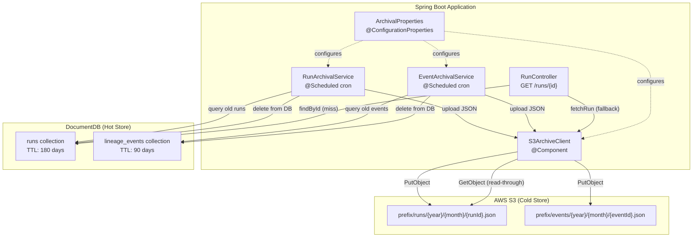
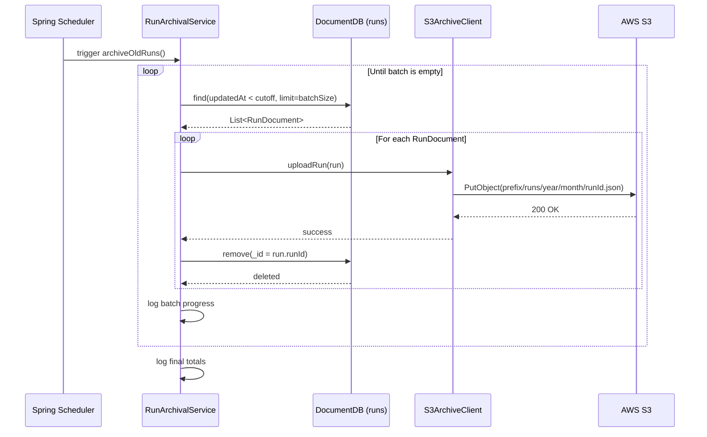
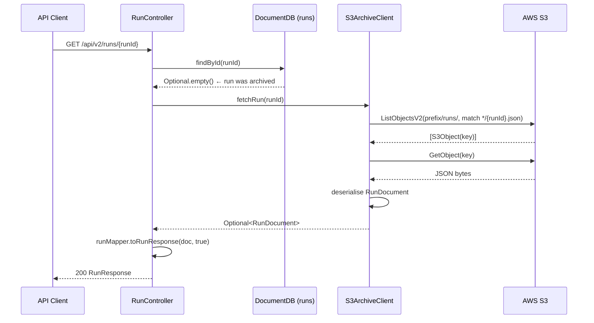
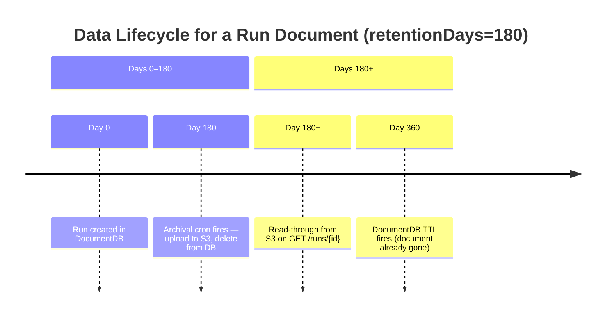

# Low-Level Design: S3 Archive System

A detailed low-level design for the S3-based archival subsystem in the OpenLineage MongoDB API. This system handles long-term retention of run and event data beyond the MongoDB TTL window, using AWS S3 as a cold-storage tier with transparent read-through access.

---

## 1. Overview

### 1.1 Purpose

The OpenLineage MongoDB API stores lineage runs and events in AWS DocumentDB with short TTL indexes (90–180 days) to cap hot storage costs. The archive system provides:

- **Durability**: Runs and events are persisted to S3 before being deleted from DocumentDB
- **Compliance**: Long-term retention beyond the DocumentDB TTL for audit and lineage history
- **Transparency**: Callers of `GET /api/v2/runs/{runId}` receive the same response whether the run is in MongoDB or archived in S3

### 1.2 Scope

| Component | Included |
|---|---|
| Run archival (MongoDB → S3) | ✅ |
| Event archival (MongoDB → S3) | ✅ |
| Read-through S3 fallback for runs | ✅ |
| Read-through S3 fallback for events | ✅ |
| Parquet batch export (future) | 🔲 |
| S3 lifecycle policies | 🔲 (infrastructure concern) |
| Cross-region replication | 🔲 (infrastructure concern) |

---

## 2. Architecture

### 2.1 Component Diagram



### 2.2 Class Responsibility Summary

| Class | Package | Responsibility |
|---|---|---|
| `ArchivalProperties` | `archival` | Bind `archival.*` properties; expose S3 bucket, prefix, region, batch size, cron |
| `S3ArchiveClient` | `archival` | Low-level S3 I/O: upload run/event JSON, fetch by ID |
| `RunArchivalService` | `archival` | Scheduled job: query old runs, upload, delete |
| `EventArchivalService` | `archival` | Scheduled job: query old events, upload, delete |
| `RunController` | `api` | Transparent S3 fallback on `GET /runs/{id}` and `GET /jobs/runs/{id}/facets` |

---

## 3. Component Detail

### 3.1 `ArchivalProperties`

Binds all `archival.*` configuration properties at startup.

```
archival:
  enabled: false                   # Master switch — disables all archival beans when false
  retention-days: 180              # Runs older than N days are eligible for archival
  batch-size: 500                  # Max documents per archival loop iteration
  cron: "0 0 3 * * *"             # Default: 3 AM daily (Spring cron: s m h dom mon dow)
  s3:
    bucket: ""                     # Target S3 bucket name (required when enabled)
    prefix: "openlineage/archive"  # Key prefix for all archived objects
    region: "eu-west-1"            # AWS region for the S3 client
```

The nested `S3Properties` class holds the bucket, prefix, and region sub-properties. All archival Spring beans are gated on `@ConditionalOnProperty(name = "archival.enabled", havingValue = "true")`, so the system is completely inert when disabled.

### 3.2 `S3ArchiveClient`

Provides four operations:

| Method | S3 Action | Key Pattern |
|---|---|---|
| `uploadRun(RunDocument)` | `PutObject` | `{prefix}/runs/{year}/{month}/{runId}.json` |
| `uploadEvent(LineageEventDocument)` | `PutObject` | `{prefix}/events/{year}/{month}/{eventId}.json` |
| `fetchRun(String runId)` | `ListObjectsV2` + `GetObject` | Searches under `{prefix}/runs/` |
| `fetchEvent(String eventId)` | `ListObjectsV2` + `GetObject` | Searches under `{prefix}/events/` |

**Serialisation:** Uses `ObjectMapper` with `JavaTimeModule` and `WRITE_DATES_AS_TIMESTAMPS = false`, so timestamps are ISO-8601 strings in the JSON payload.

**S3 Client initialisation:** The `S3Client` is built using the AWS SDK v2 default credential provider chain (IAM role → environment variables → `~/.aws/credentials`). No explicit credentials are required in application properties.

**Key year/month derivation:** Uses the document's `createdAt` field. If `createdAt` is null (legacy data), falls back to `ZonedDateTime.now()`.

**Error handling on upload:** Any S3 SDK exception is wrapped and re-thrown as `RuntimeException`, which causes the archival service to catch it, log it, and count it as a failed document.

**Error handling on fetch:** Exceptions are caught, logged at `WARN`, and `Optional.empty()` is returned so the read-through caller can decide what to do.

#### S3 Object Layout

```
s3://bucket/
└── openlineage/archive/
    ├── runs/
    │   ├── 2024/
    │   │   ├── 01/
    │   │   │   ├── {runId-A}.json
    │   │   │   └── {runId-B}.json
    │   │   └── 02/
    │   │       └── {runId-C}.json
    │   └── 2025/
    │       └── 03/
    │           └── {runId-D}.json
    └── events/
        └── 2024/
            └── 01/
                ├── {eventId-X}.json
                └── {eventId-Y}.json
```

### 3.3 `RunArchivalService`

Cron-driven service that moves old run documents from DocumentDB to S3.

**Trigger:** `@Scheduled(cron = "${archival.cron}")` — runs at the configured cron time (default 3 AM daily).

**Eligibility cutoff:** `ZonedDateTime.now().minusDays(retentionDays)`. Documents with `updatedAt < cutoff` are candidates.

**Loop logic:**

```
REPEAT until no more eligible documents:
  1. Query at most batchSize runs with updatedAt < cutoff
  2. FOR EACH run in batch:
     a. uploadRun(run) → S3
     b. delete run from MongoDB
     c. increment totalArchived counter
     d. on exception: increment totalFailed, log error, continue
  3. Log batch progress
END REPEAT
Log final totals
```

**Atomicity note:** There is no transactional guarantee between the S3 upload and the MongoDB delete. If the process crashes between steps 2a and 2b, the run will be re-uploaded on the next run (idempotent key). If the crash is after 2b, the data is safe in S3 only — which is the desired end state.

### 3.4 `EventArchivalService`

Identical structure to `RunArchivalService` but for `lineage_events`.

**Cutoff offset:** Archives events at `retentionDays - 10` days (minimum 30 days) instead of the full `retentionDays` value. This ensures events are archived to S3 before the DocumentDB TTL index deletes them at the 90-day mark.

**Query field:** Uses `createdAt` (not `updatedAt`) to match the TTL index field on the `lineage_events` collection.

---

## 4. Archival Flow

### 4.1 Run Archival Sequence



### 4.2 Read-Through Fallback Sequence



If `s3ArchiveClient` is `null` (archival disabled) or S3 returns an empty result, `RunController` throws `404 Not Found`.

---

## 5. S3 Object Format

### 5.1 Archived Run (`RunDocument`)

```json
{
  "_id": "550e8400-e29b-41d4-a716-446655440000",
  "jobNamespace": "scheduler",
  "jobName": "etl_pipeline.task_1",
  "eventTime": "2024-01-15T10:30:00Z",
  "eventType": "COMPLETE",
  "startTime": "2024-01-15T10:00:00Z",
  "endTime": "2024-01-15T10:30:00Z",
  "inputs": [
    { "namespace": "s3://bucket", "name": "raw_data", "facets": {} }
  ],
  "outputs": [
    { "namespace": "s3://bucket", "name": "curated_data", "facets": {} }
  ],
  "runFacets": {
    "nominalTime": { "nominalStartTime": "2024-01-15T10:00:00Z" }
  },
  "createdAt": "2024-01-15T10:00:05Z",
  "updatedAt": "2024-01-15T10:30:15Z"
}
```

### 5.2 Archived Event (`LineageEventDocument`)

```json
{
  "_id": "evt-auto-id-string",
  "createdAt": "2024-01-15T10:30:00Z",
  "eventTime": "2024-01-15T10:30:00Z",
  "event": {
    "eventType": "COMPLETE",
    "eventTime": "2024-01-15T10:30:00Z",
    "run": { "runId": "550e8400-...", "facets": {} },
    "job": { "namespace": "scheduler", "name": "etl_pipeline.task_1" },
    "inputs": [...],
    "outputs": [...],
    "producer": "spark-openlineage"
  }
}
```

All timestamps are serialised as ISO-8601 strings (not epoch milliseconds) by the `ObjectMapper` configuration.

---

## 6. Configuration Reference

| Property | Default | Description |
|---|---|---|
| `archival.enabled` | `false` | Master switch. Set to `true` to activate all archival beans |
| `archival.retention-days` | `180` | Days after which runs are eligible for archival |
| `archival.batch-size` | `500` | Max documents per cron loop iteration |
| `archival.cron` | `"0 0 3 * * *"` | Spring cron expression for archival trigger |
| `archival.s3.bucket` | `""` | S3 bucket name (required when enabled) |
| `archival.s3.prefix` | `"openlineage/archive"` | Object key prefix |
| `archival.s3.region` | `"eu-west-1"` | AWS region for S3 client |

**Minimal production configuration:**

```yaml
archival:
  enabled: true
  retention-days: 180
  batch-size: 500
  cron: "0 0 3 * * *"
  s3:
    bucket: my-openlineage-archive-bucket
    prefix: openlineage/prod/archive
    region: eu-west-1
```

AWS credentials must be available via the default credential provider chain (IAM task role for ECS, instance profile for EC2/EKS).

---

## 7. Error Handling

### 7.1 Upload Failure

If `S3Client.putObject()` throws, `S3ArchiveClient.upload()` wraps the exception and re-throws. The archival service catches this per-document and:
- Increments `totalFailed`
- Logs the error at `ERROR` level with the document ID
- Continues to the next document in the batch

The failed document remains in DocumentDB and will be retried on the next cron run.

### 7.2 Fetch Failure

If `S3Client.listObjectsV2()` or `S3Client.getObject()` throws during a read-through fetch, the exception is caught and logged at `WARN`. `Optional.empty()` is returned. `RunController` then returns `404 Not Found` to the caller.

### 7.3 Partial Failure Between Upload and Delete

If the JVM crashes after uploading to S3 but before deleting from DocumentDB, the document remains in MongoDB. On the next archival run, `uploadRun()` will overwrite the S3 object with the same key (idempotent), and then the delete will succeed. No data is lost.

### 7.4 Concurrent Archival Runs

Spring's `@Scheduled` uses a single-threaded executor by default. If two pods are running simultaneously (e.g., ECS service with replicas > 1), both may attempt to archive the same document. This is safe because:
1. S3 upload is idempotent (same key overwrites)
2. MongoDB `remove(_id = X)` is a no-op if the document was already deleted by another instance

---

## 8. Interaction with TTL Indexes

The MongoDB TTL index and the archival cron are **complementary but independent** mechanisms:

| Collection | TTL Duration | Archival Trigger |
|---|---|---|
| `runs` | 180 days | `retentionDays` (default 180) |
| `lineage_events` | 90 days | `retentionDays - 10` (default 170→uses max(170-10,30) = 80 days) |

The archival cron fires **before** the TTL to ensure data lands in S3 before DocumentDB auto-deletes it. For events, the buffer is `retentionDays - 10` (minimum 30 days) applied against the 90-day TTL.



---

## 9. Observability

### 9.1 Log Events

All archival components use SLF4J (`LoggerFactory`). Key log messages:

| Level | Class | Event |
|---|---|---|
| `INFO` | `RunArchivalService` | Archival start/end with total counts |
| `INFO` | `RunArchivalService` | Per-batch progress |
| `ERROR` | `RunArchivalService` | Per-document failure |
| `INFO` | `EventArchivalService` | Archival start/end with total counts |
| `ERROR` | `EventArchivalService` | Per-document failure |
| `DEBUG` | `S3ArchiveClient` | Successful upload with full S3 URI |
| `WARN` | `S3ArchiveClient` | Failed read-through fetch |

### 9.2 Metrics

The Spring Boot Actuator and Micrometer Prometheus integration provides JVM and HTTP metrics. No custom archival-specific metrics are registered out of the box. To add them, inject a `MeterRegistry` into the archival services and record:

- `archival.runs.archived.count` — counter
- `archival.runs.failed.count` — counter
- `archival.events.archived.count` — counter
- `archival.events.failed.count` — counter
- `archival.duration.seconds` — timer

---

## 10. IAM Permissions

The ECS task role (or EC2/EKS instance profile) requires the following S3 permissions on the target bucket:

```json
{
  "Version": "2012-10-17",
  "Statement": [
    {
      "Effect": "Allow",
      "Action": [
        "s3:PutObject",
        "s3:GetObject",
        "s3:ListBucket"
      ],
      "Resource": [
        "arn:aws:s3:::my-openlineage-archive-bucket",
        "arn:aws:s3:::my-openlineage-archive-bucket/*"
      ]
    }
  ]
}
```

`s3:ListBucket` is required because `fetchRun()` and `fetchEvent()` use `ListObjectsV2` to locate the object by suffix (the ID can be in any year/month partition).

---

## 11. Future Improvements

| Enhancement | Rationale |
|---|---|
| **Parquet output** | The `parquet-avro` and `hadoop-common` dependencies are already in `pom.xml`. Batch-writing runs/events to columnar Parquet files (one per day per entity type) would reduce S3 object count, enable Athena/Glue querying, and improve compression. |
| **S3 prefix listing cache** | `fetchRun()` lists all objects under `prefix/runs/` to find a single ID. For large archives this is slow. Adding a `{prefix}/runs/index/{runId} → {year}/{month}` index object (or a DynamoDB lookup table) would allow direct `GetObject` without listing. |
| **Dead-letter bucket** | Failed uploads currently stay in DocumentDB for retry. A dedicated dead-letter S3 prefix for consistently failing documents would make failures visible and allow manual recovery. |
| **SQS-based archival trigger** | Replace the cron with an SQS listener consuming DocumentDB change stream events (when DocumentDB change streams become fully supported) for near-real-time archival at scale. |
| **Configurable per-entity retention** | Currently `retentionDays` applies to both runs and events. Separate `archival.run-retention-days` and `archival.event-retention-days` properties would allow independent tuning. |
